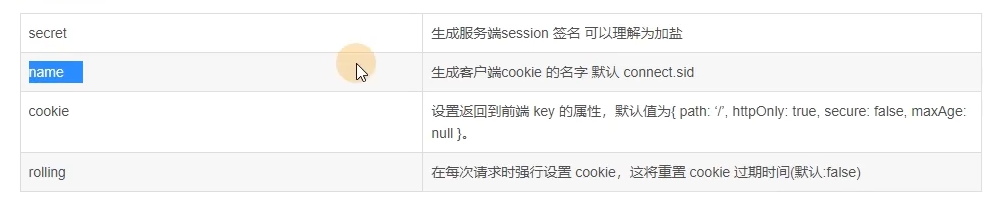

# Nest Session 小案例

> Session 是服务器为用户的浏览器创建的一个会话对象，这个 session 会记录到浏览器的 cookie 用来区分用户

## 使用 Sessioin

使用 Nest 默认框架 Express

```bash
npm i express-session --save

npm i @types/express-session -D
```

然后在 main.ts 中通过 app.use 注册 session

```ts
import { NestFactory } from "@nestjs/core";
import { AppModule } from "./app.module";
import { VersioningType } from "@nestjs/common";
import * as session from "express-session";

async function bootstrap() {
  const app = await NestFactory.create(AppModule);
  app.enableVersioning({
    type: VersioningType.URI,
  });
  app.use(
    session({
      secret: "secretKey",
      rolling: true,
      name: "wujinhao.sid",
      cookie: {
        httpOnly: true,
        maxAge: 1000 * 60 * 60 * 24, // 1 day
      },
    })
  );
  await app.listen(process.env.PORT ?? 3000);
}
bootstrap();
```

session 的配置项


## 实现验证码校验

使用 `svg-captcha` 实现验证码的生成

```ts
import * as svgCaptcha from "svg-captcha";
```

实现一个 get 方法，由客户端请求接口获取验证码

```ts
@Get('code')
createCode(@Req() req:any, @Res() res:any, @Session() session:any) {
  const cpc = svgCaptcha.create({ // 创建验证码
    size: 4,
    fontSize: 50,
    width: 100,
    height: 34,
    background: '#cc9966',
  });
  session.code = cpc.text; 
  res.type('image/svg+xml');
  res.send(cpc.data);
}
```

通过 post 方法模拟用户登陆，并校验验证码
```ts
@Post('create')
createUser(@Body() body: any, @Session() session: any) {
  console.log(body, session.code);
  if (body.code.toLocaleLowerCase() !== session.code.toLowerCase()) {
    return { code: 400, msg: '验证码错误' };
  } else {
    return {
      code: 200,
      msg: '登陆',
    };
  }
}
```