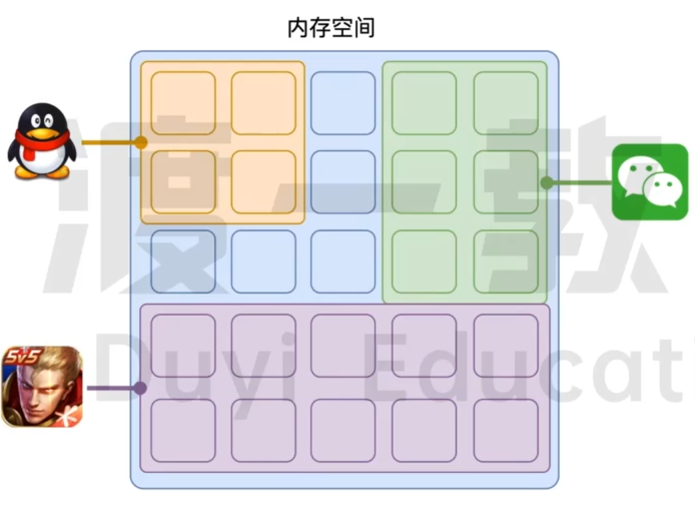
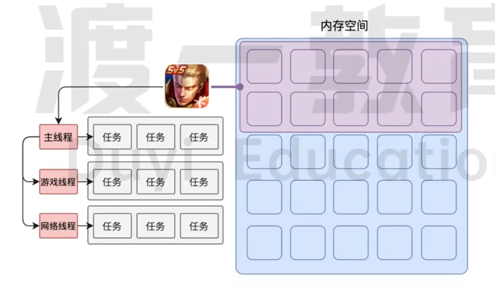
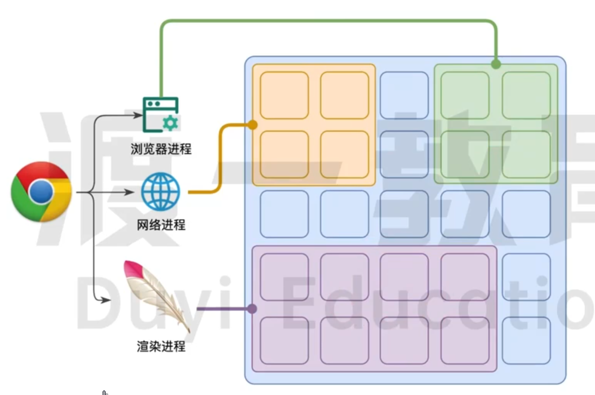
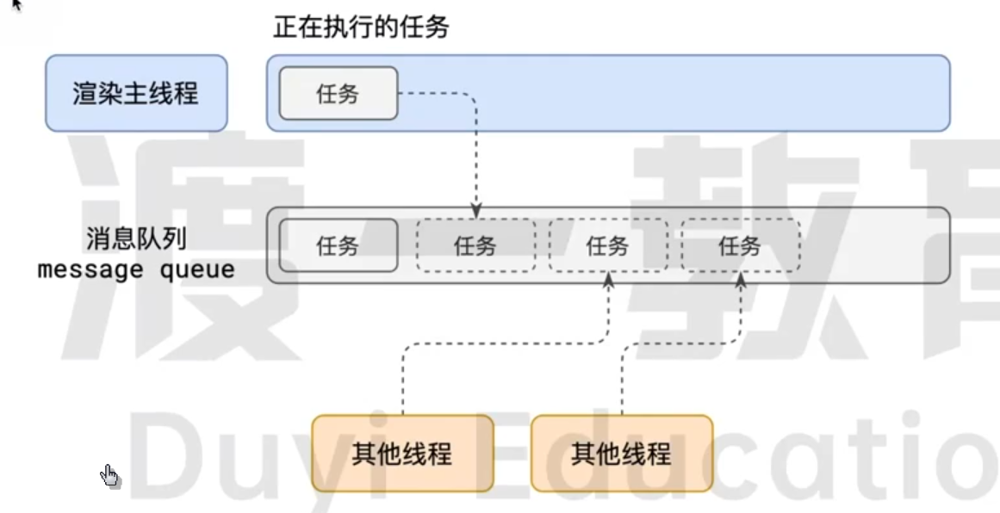
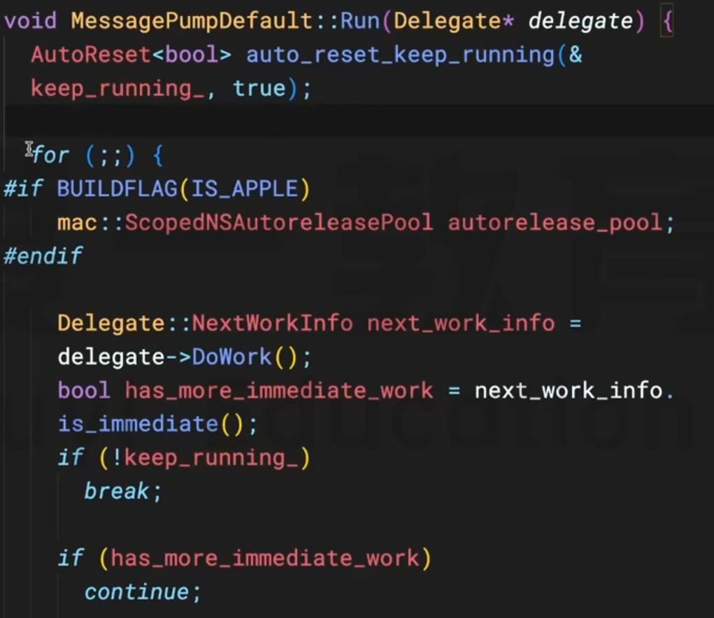
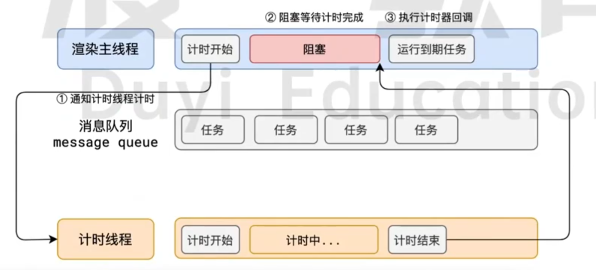
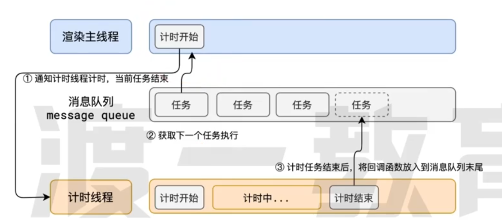

# 事件循环

---

## **一. 浏览器的进程模型**

### 何为进程?

> *程序运行需要有他自己专属的而内存空间, 可以把这块内存空间简单的理解为进程*
> 
> 
> *每个应用至少有一个进程, 进程之间相互独立, 即使要通信, 也需要双方同意*
> 

<!--  -->

进程

### 何为线程?

> *有了进程之后, 就可以运行程序代码了.*
> 
> 
> *运行代码的 "人" 称之为 "线程".*
> 
> *一个进程至少有一个线程, 所以在进程开启后会自动创建一个线程来运行代码, 该线程称之为主线程.*
> 
> *如果程序需要同时执行多行代码, 主线程就会启动更多的线程来执行代码, 所以一个进程中可以包含多个线程.*
> 

<!--  -->

线程

## **二. 浏览器有哪些进程和线程?**

### **浏览器是一个多进程多线程的应用程序**

> *浏览器的内部工作十分复杂*
> 
> 
> *为了避免相互影响, 为了减少连环崩溃的几率没, 当启动浏览器后, 他会自动启动多个进程*
> 


<!--  -->

浏览器进程模型

> *可以在浏览器的任务管理器中查看当前的所有进程*
> 

其中, 最主要的进程有:

1. 浏览器进程

> *主要负责界面展示, 用户交互, 子进程管理等. 浏览器进程内部会启动多个线程处理不同的任务*
> 
1. 网络进程

> *负责加载网络资源. 网络进程内部会启动多个线程来处理不同的网络任务.*
> 
1. 渲染进程

> *渲染进程启动后, 会开启一个 渲染主线程  , 主线程负责执行`HTML`,`CSS`,`JS`代码*
> 
> 
> *默认情况下, 浏览器会为每个标签页开始一个新的渲染进程, 以保证不同的标签页之间不会相互影响*
> 

## **三. 渲染主线程是如何工作的?**

> ***渲染主线程是浏览器中最繁忙的线程**, 需要他处理的任务包括但不限于:*
> 
1. 解析HTML
2. 解析CSS
3. 计算样式
4. 布局
5. 处理图层
6. 每秒把网页画 60 次 (FPS)
7. 执行全局 JS 代码
8. 执行事件处理函数
9. 执行计时器回调函数
10. ……

主线程要处理这么多的任务, 主线程遇到了一个前所未有的难题: `如何调度任务`?
比如:

- 正在执行一个 js 函数, 执行到一半的时候用户点击了按钮, 我该立刻去执行点击事件的处理函数吗?
- 正在执行一个 JS 函数, 执行到一半的时候某个计时器到达了事件, 我该立刻去执行他的回调函数吗?
- 浏览器进程通知我"用户点击了按钮", 与此同时, 某个计时器也到达了时间, 我该处理哪一个呢?

渲染主线程想出了一个绝妙的主意来处理这个问题: `队列(queue)`


<!--  -->

渲染主线程工作原理

1. 在最开始的时候, 渲染主线程会进入一个`无限循环`


<!--  -->

message_loop/message_pump-default.cc

1. 每一次循环会检查消息队列中是否有任务存在. 如果有, 就取出第一个任务执行, 执行完一个后进入下一次循环; 如果没有, 则进入休眠模式
2. 其他所有线程 (包括其他进程的线程) 可以随时向消息队列添加任务. `新任务会加到消息队列的末尾`. 在添加新任务时,如果主线程是休眠状态, 则会`将其唤醒以继续循环拿取任务`

这样一来, 就可以让每个任务有条不紊, 持续的进行下去了

**整个过程, 被称之为事件循环 (消息循环)**

## 四. 若干解释

### 何为异步?

代码在执行过程中, 会遇到一些无法立即执行的任务, 比如:

- 计时完成后需要执行的任务 — `setTimeout` , `setInterval`
- 网络通信完成后需要执行的任务 — `XHR`, `Fetch`
- 用户操作后需要执行的任务 — `addEventListener`

如果让渲染主线程等待这些任务的时机到达, 就会导致主线程长期处于 **`阻塞`** 的状态, 从而导致浏览器 **`卡死`**


<!--  -->

同步代码逻辑 (synchronous)

**渲染主线程承担着极其重要的工作, 无论如何不能阻塞!**

因此, 浏览器选择 **异步** 来解决这个问题

<!--  -->

异步代码逻辑 (asynchronous)

使用异步的方式, **渲染主线程永不阻塞**

[如何理解 JS 的异步?](./何为异步.md)

### JS为何会阻塞渲染?

示例代码:

```jsx
<h1>Hello World!</h1>
<button>change</button>
<script>
	var h1 = document.querySelector('h1');
	var button = document.querySelector('button');
	// 死循环指定的时间
	function delay(duration) {
		var start = Date.now();
		while (Date.now() - start < duration) {}
	}
	button.onclick = function() {
		h1.textContent = 'Hello JavaScript!';
		delay(3000);
	}
</script>
```

> 为什么会卡死呢? :
当鼠标点击按钮的时候, 事件回调函数会被包装成任务push到消息队列, 渲染主线程从消息队列中取出任务执行, 首先会对h1的文本进行修改, 也确实进行了修改, 但是并没有渲染到页面当中去, 渲染这个事情就是另一个任务了, 所以渲染h1这个任务就会被push进消息队列, 但是渲染主线程的任务并没有结束, 他需要循环 duration 秒, 当跳出循环时, 渲染主线程从消息队列中获取渲染任务并执行其中的代码, 此时页面中的文字才会被更新
> 

### 任务有优先级吗?

任务没有优先级, 在消息队列中先进先出

但**消息队列是有优先级的**

根据 W3C 的最新解释:

- 每个任务都有一个任务类型, 同一个类型的任务必须在一个队列, 不同类型的任务可以分属于不同的队列, 再一次事件循环中, 浏览器可以根据实际情况从不同的队列中取出任务执行.
- 浏览器必须准备好一个微队列 (microtask queue) , 微队列中的任务优先所有的其他任务执行

> 随着浏览器的复杂度急剧提升, W3C 不再使用宏队列的说法
> 

在目前的 chrome 浏览器中, 至少包含了下面的队列:

- 延时队列: 用于存放计时器到达后的回调任务, 优先级 [中]
- 交互队列: 用于存放用户操作后产生的时间处理任务, 优先级 [高]
- 微队列: 用户存放需要最快执行的任务, 优先级 [最高]

> 添加任务到微队列的主要方式是使用 Promise, MutationObserver
例如:
> 

```jsx
Promise.resolve().then(函数)
```

示例代码 (事件循环例题代码):

```jsx
setTimeout(() => {
    console.log(1)
}, 0);

console.log(2)
```

```jsx
function delay(duration) {
  var start = Date.now();
  while (Date.now() - start < duration) {}
}

setTimeout(() => {
  console.log(1);
}, 0);

delay(1000);

console.log(2);
```

```jsx
setTimeout(() => {
  console.log(1);
}, 0);

Promise.resolve().then(() => {
  console.log(2);
});

console.log(3);
```

```jsx
function a() {
    console.log(1);
    Promise.resolve().then(function () {
        console.log(2);
    })
}

setTimeout(() => {
    console.log(3);
    Promise.resolve().then(a)
}, 0);

Promise.resolve().then(function() {
    console.log(4);
})

console.log(5);
```

> 浏览器还有很多其他的队列, 由于和我们开发关系不大, 不做考虑
> 

[阐述一下 JS 的事件循环](./简述事件循环.md)

[JS 中的计时器能精确进行吗?](./JS%20计时器能够精确运行.md)